```{r setup, echo=FALSE}
options(htmltools.dir.version = FALSE)
knitr::opts_chunk$set(
  dpi=300,
  out.width = "100%",
  cache = FALSE,
  echo = FALSE,
  message = FALSE, 
  warning = FALSE,
  hiline = TRUE
)

xaringanExtra::use_logo(
  position = xaringanExtra::css_position(top = "2.5em", right = "1.5em"),
  image_url = "https://upload.wikimedia.org/wikipedia/fr/d/d2/Universit%C3%A9_de_Gen%C3%A8ve_%28logo%29.svg"
)

```

<style>


</style>


# Table des matières

.startup_center[

.div.blue[
- Download and Install R
]

.div.blue[
- Download and Install Rstudio 
]

.div.blue[
- What is R ?
]

.div.blue[
- Hands on part
] ]

---


```{r include=FALSE}
knitr::opts_chunk$set(comment = NA)
```


```{r packages, results='hide', message=FALSE, include=FALSE, warning=FALSE}
#this is to check to see if package are installed and if not to install them or just load them if they are installed!
if(!require(pacman)) {install.packages(c("pacman", "remotes"))}

pacman::p_load(dplyr,ggplot2, gapminder)

#The pacman package that can do this nicely. The function p_load in the package does this. The first line is just to ensure that pacman is installed.

```


# Download R 4.2 ("Vigorous Calisthenics") 

.startup[

.pull-left[

#Choose your side !

## - Windows -> [link](https://cran.r-project.org/bin/windows/base/)

## - Mac -> [link](https://cran.r-project.org/bin/macosx/)

## - GNU-Linux -> [link](https://munoztd0.github.io/Hitchhikers_guide_to_the_brain/install#RRstudio_)


]

.pull-right[
.startup[


```{r, out.width = "250px", fig.align="center" , echo=FALSE}


```

### (Or just fire up your browser and type "R project")

]]]

---

# Windows

.startup[

 <iframe src="https://cran.r-project.org/bin/windows/base" width="100%" height="500px" id="iframe1" marginheight="0" frameborder="0" onload='javascript:resizeIframe(this);'></iframe>
 
]
 


---


# Mac

.startup[

 <iframe src="https://cran.r-project.org/bin/macosx/" width="100%" height="500px" id="iframe1" marginheight="0" frameborder="0" onload='javascript:resizeIframe(this);'></iframe>
 
]
 


---


# Follow the install wizard

.startup[


### (You should be good while just clicking "next" and agreeing)


```{r, out.width = "350px", fig.align="center" , echo=FALSE}

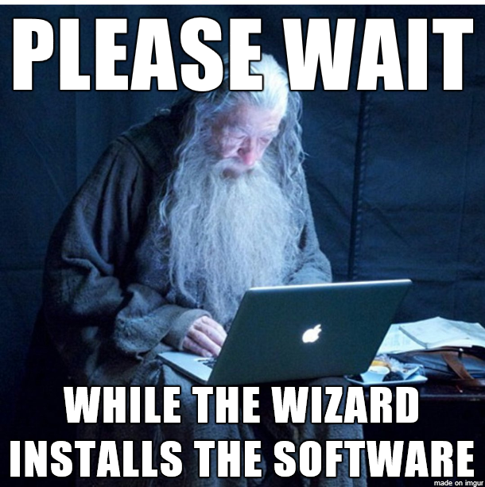

```

 ]

 


---


# Download RStudio 

.startup[


## - All OS -> [link](https://www.rstudio.com/products/rstudio/download/#download)


Just click on the blue button (it will automatically detect which OS you are)

### (Or just fire up your browser and type "RStudio download")


```{r, out.width = "650px", fig.align="center" , echo=FALSE}

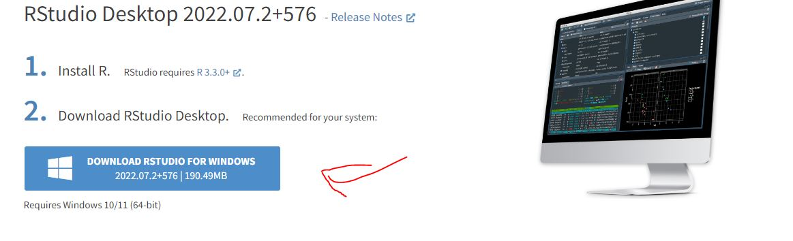

```


]

---

# Follow the install wizard (again)

.startup[


### (You should be good while just clicking "next" and agreeing)


```{r, out.width = "350px", fig.align="center" , echo=FALSE}


```

 ]
 
 
---
class: inverse center middle

# What is all of this ?

.startup[

```{r, out.width = "650px", fig.align="center" , echo=FALSE}

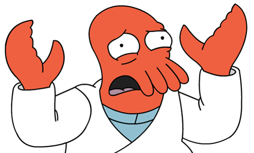

```

]

---


# What the heck is R ?

.startup[


- **R** is a **programming language**, which helps you do **data analysis** by writing **functions** and **scripts**, instead of pointing and clicking.


- **R** was first implemented in the early 90’s by **Robert Gentleman** and **Ross Ihaka**, in New Zealand


- **R** is a coding language **vastly used in the biological sciences** (as well as other disciplines) to do data analysis.


```{r, out.width = "400px", fig.align="center" , echo=FALSE}

knitr::include_graphics("img/inventors.png")

```

 ]
 
---

 
# What the heck is a package ?

.startup[

.pull-left[

- **R packages** are **collections of R functions**, and code. While R comes with a set of packages by default, there are **many more packages** (think like "extensions" on your browser) that **can be added** to extend the capabilities of **R**. 

- Whether you're using **R** to do simple or complex analysis, **experts** in every domain have made resources, applications and code **available for free**, online.

- In the 2000s, **Hadley Wickham** revolutionized data science thanks to his design of a vast number of **wildly popular packages** to solve major problems.

]

.pull-right[


```{r, out.width = "250px", fig.align="center" , echo=FALSE, comment=NA}

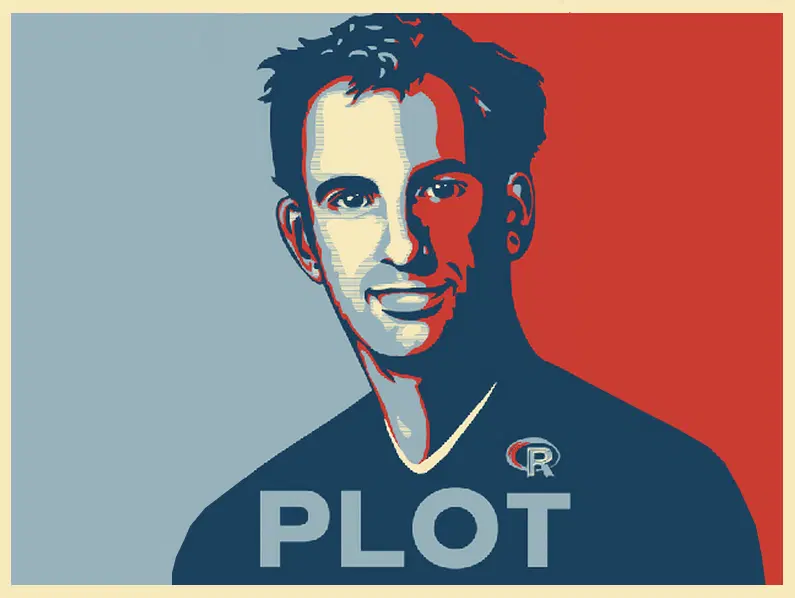
cat("                Hadley Wickham")

```


```{r, out.width = "450px", fig.align="center" , echo=FALSE}

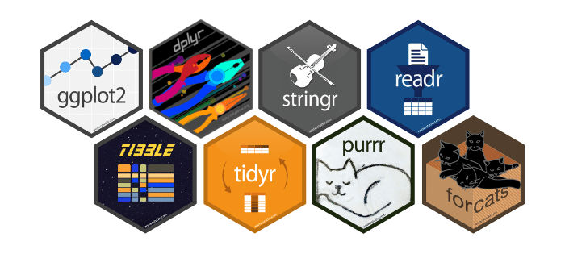

```

] ]

---


 
# What the heck is RStudio ?

.startup[

.pull-left[

- **R studio** is and **integrated development environment** (IDE)) it is like a secondary program that **makes R actually usable by 'laypeople'** and gives it a **nice graphical user interface** (GUI).


- It also lets you compile and **run the code at once**, as well as** put together documents** that have code and non-code sections (**like this very presentation**).

- (FYI **Rstudio** is rebranding and it will be called **Posit** next year, but this won't affect anything to us)


]

.pull-right[


```{r, out.width = "250px", fig.align="center" , echo=FALSE, comment=NA}

knitr::include_graphics("img/Rstudio.png")

```


```{r, out.width = "450px", fig.align="center" , echo=FALSE}

knitr::include_graphics("img/darkRstudio.png")

```

] ]


---

class: inverse center middle
 
# Let's try this!

.startup[

```{r, out.width = "550px", fig.align="center" , echo=FALSE, comment=NA}

knitr::include_graphics("img/darkRstudio.png")

```


You should have a shortcut "RStudio" in your desktop or just look in your applications.


```{r, out.width = "250px", fig.align="center" , echo=FALSE, comment=NA}

knitr::include_graphics("img/Rstudio.png")

```


] 


---


# A quick tour of Rstudio - Document pane

.startup[


When you first arrive there only will be 3 panes. But another one activate when your have an open a document (**script**).


On the top left: **document** pane (where you **edit scripts** or **view data**)

]


<br>


```{r, out.width = "650px", fig.align="center" , echo=FALSE, comment=NA}

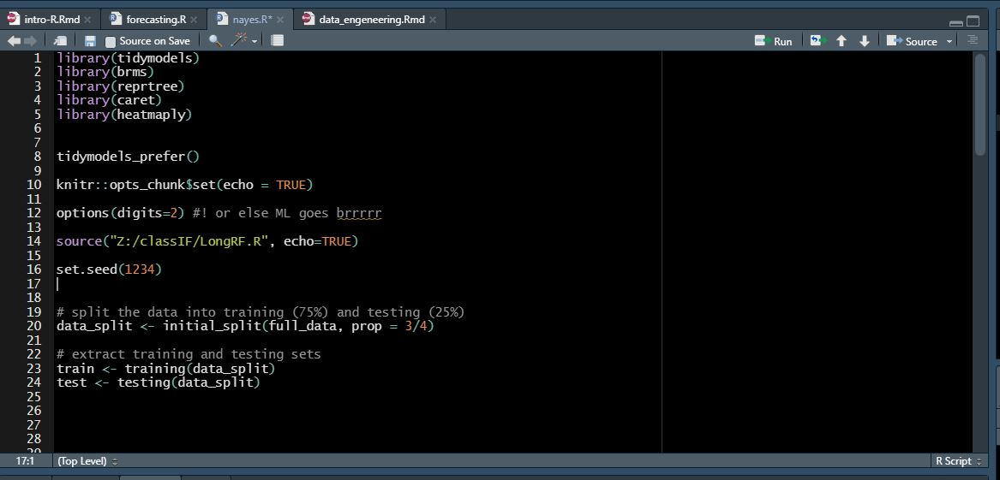

```


 ]


---


# A quick tour of Rstudio - Console pane

.startup[


On the bottom left: **the console** (an area where you can **execute commands** into R)


<br>


```{r, out.width = "1050px", fig.align="center" , echo=FALSE, comment=NA}

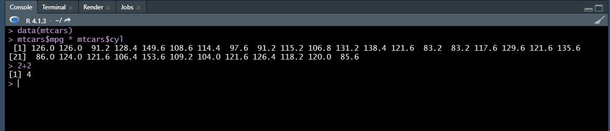

```


 ] 
 

---


# A quick tour of Rstudio - Environment pane

.startup[


On the top right: **the environment** pane (information about your R environment. i.e. your **variables, functions**, etc.)


<br>


```{r, out.width = "850px", fig.align="center" , echo=FALSE, comment=NA}

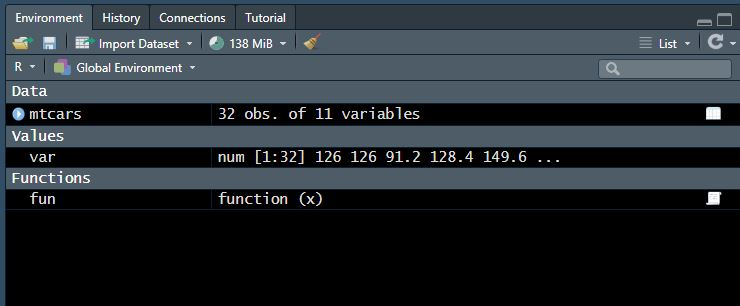

```


 ] 


---


# A quick tour of Rstudio - tabular pane

.startup[


On the bottom right: **the tabular** pane (has 5 tabs which we will look into just next)


<br>


```{r, out.width = "550px", fig.align="center" , echo=FALSE, comment=NA}

knitr::include_graphics("img/darkRstudio.png")

```


 ] 


---


# The tabular pane dissected - Files

.startup[


- **Files**: Where you can **browse your files**, search through directories


```{r, out.width = "750px", fig.align="center" , echo=FALSE, comment=NA}

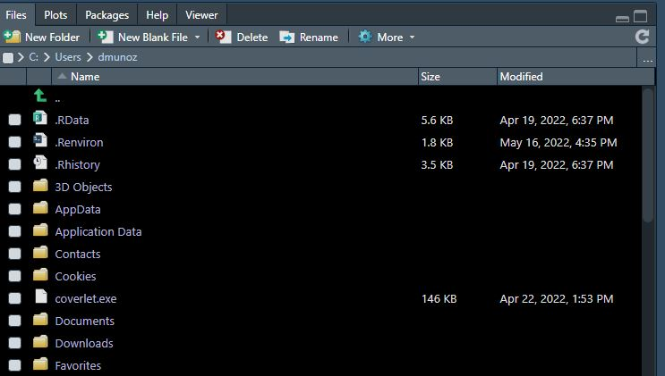

```


] 


---


# The tabular pane dissected - Plots

.startup[


- **Plots**: Where you can see your **graphics**


```{r, out.width = "550px", fig.align="center" , echo=FALSE, comment=NA}

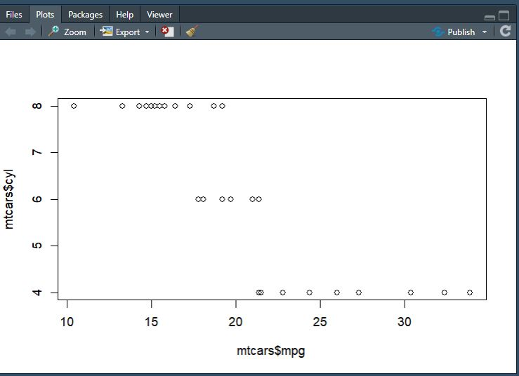

```


] 


---

# The tabular pane dissected - Packages

.startup[


- **Packages**: Where you can **install and manage your packages**
Tip: just type help(something) or ??something into the R console pane to get some help


```{r, out.width = "650px", fig.align="center" , echo=FALSE, comment=NA}

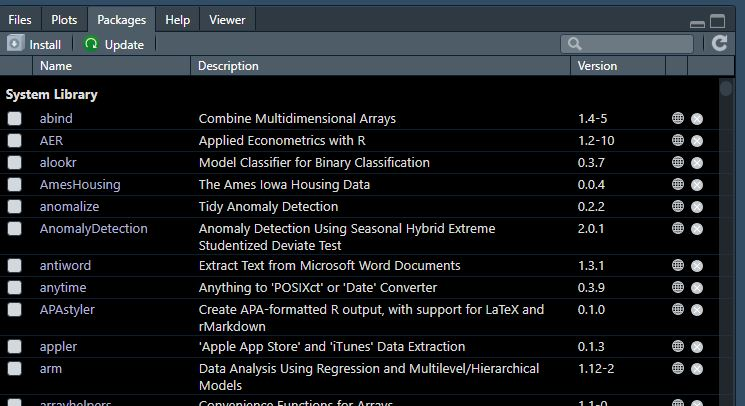

```


] 

---


# The tabular pane dissected - Help

.startup[


- **Help**: Where you find **documentation**


```{r, out.width = "550px", fig.align="center" , echo=FALSE, comment=NA}

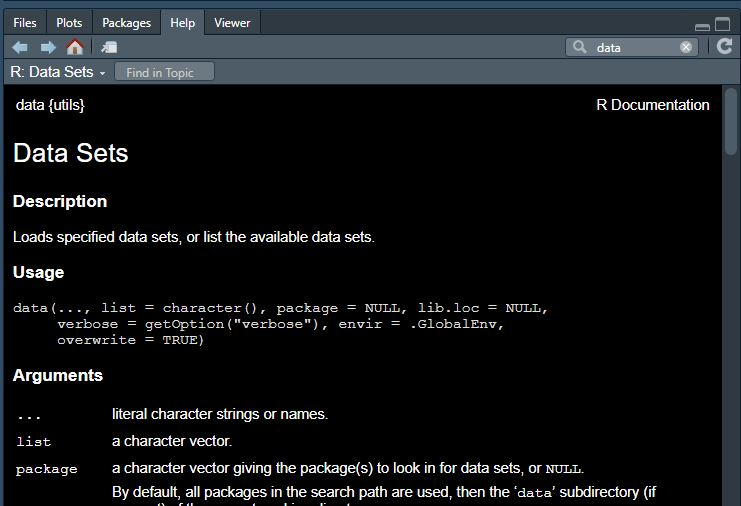

```


] 

---

# The tabular pane dissected - Viewer

.startup[


- **Viewer**: Where you can **preview html** (web) renders


```{r, out.width = "550px", fig.align="center" , echo=FALSE, comment=NA}

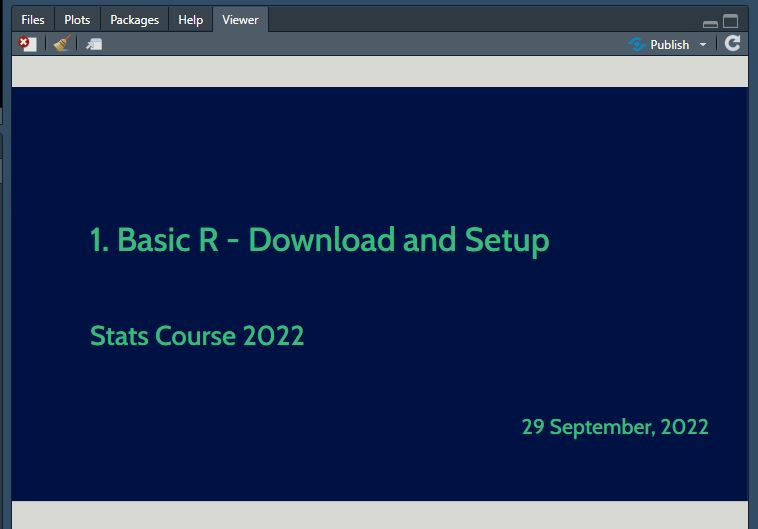

```


] 

---
class: inverse center middle

# Let's try to do something ?


.startup[

```{r, out.width = "450px", fig.align="center" , echo=FALSE, comment=NA}


```
]

---

# Grab some data from moodle


.startup[


## Login into this course moodle page -> [link](https://moodle.unige.ch/course/view.php?id=12435)

.pull-left[

Go to :

Data -> Data and Code -> and click on **"ExerciceBisphenol.csv"**

And now **save it** to you **"Downloads"** folder

]

.pull-right[

```{r, out.width = "350px", fig.align="center" , echo=FALSE}

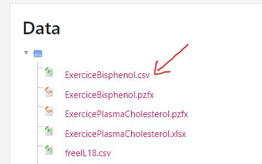

```

]]


---

# Upload the data through RStudio


.startup[


.pull-left[

- Go to the **Files** tab.

- Look at where you are (the path just below "New Folder").

- Now try to navigate to your **"Downloads"** folder.

- Find the **"ExerciceBisphenol.csv"** file and **click on it**.

- Now choose **import dataset**. This will open up a new window.


]


.pull-right[

```{r, out.width = "450px", fig.align="right" , echo=FALSE}

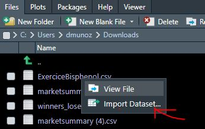


```

] ]


---

# Upload the data through RStudio


.startup[


- Just click on **import**


```{r, out.width = "750px", fig.align="right" , echo=FALSE}

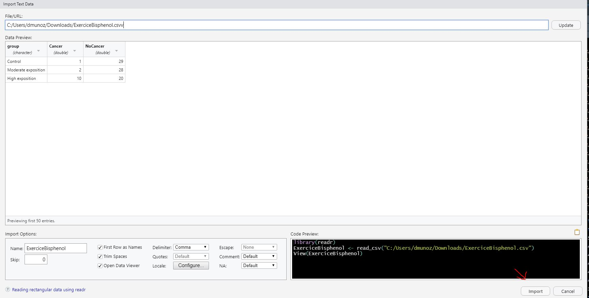

```

] 


---
class: inverse center middle

# Congrats you did it !


.startup[

```{r, out.width = "450px", fig.align="center" , echo=FALSE, comment=NA}


```
]


---
class: middle, inverse, title-slide

.pull-left[
# Thank you for joining us!
<br/>

You can find my contact information linked on this slide if you want to get in touch, and I'm happy to take any questions.


]

.pull-right[

<br/><br/>


[`r fontawesome::fa("github", a11y = "sem", fill = "#FFFFFF")` Github page](https://github.com/munoztd0)<br/>
[`r fontawesome::fa("youtube", a11y = "sem", fill = "#FFFFFF")` Tuto Channel](https://www.youtube.com/channel/UCGktdbvbc_H-JEkYYTvwRVw)<br/>
[`r fontawesome::fa("desktop", a11y = "sem", fill = "#FFFFFF")` Teaching Page](https://wedata.ch/teaching.html)<br/>


<br/><br/>

[this presentation code](https://github.com/munoztd0/intro_R_cours_stats_2022)


]]


---
class: inverse center middle

# More ?


.startup[

```{r, out.width = "450px", fig.align="center" , echo=FALSE, comment=NA}


```
]


---

# Install packages

.startup[ 

You can plot things without any additional packages but for the sake of learning how to it we will install **ggplot2 and gampminder**.

- the "gg" stands for **"grammar of graphics"**, it is a package to help you produce beautiful data visualization

- **gaminder** is just to have an easy to load dataset

.pull-left[

To install them either run these lines inside the **console**:

```{r echo=TRUE, eval=FALSE}

install.packages("ggplot2")

install.packages("gapminder")

```


or through the **GUI** go to  the **packages** pane and click on **install package**

]


.pull-right[


```{r, out.width = "350px", fig.align="center" , echo=FALSE, comment=NA}

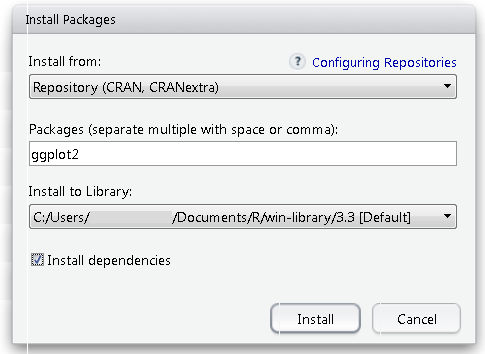

```

]]

---


# Load packages

.startup[ 
.startup[ 


To load them either run these lines inside the **console**:

```{r echo=TRUE, eval=FALSE}

library("ggplot2")

library("gapminder")

```


or through the **GUI** go to  the **packages** pane and check the box of the packages you want to load

]]


---


# Check your data

.startup[ 

.startup[ 


To view a dataset just run this line inside the **console**:

```{r echo=TRUE, eval=FALSE}

View(gapminder)

```

```{r echo=F, eval=T}

head(gapminder)

```
]]


---


# Now plot !

.startup[ 


.pull-left[

<br>

To plot a dataset just run these lines inside the **console** (we will go through what it does and how later don't worry): 


```{r echo=T, eval=F, out.width = "850px"}

gapminder |>
  ggplot( aes(x=gdpPercap, y=lifeExp,
    color=continent)) +
    geom_point()

```

] 

.pull-right[

```{r echo=F, eval=T}

gapminder |>
  ggplot( aes(x=gdpPercap, y=lifeExp, color=continent)) +
    geom_point()

```

]]
---


# Can we do better ?

.startup[ 


```{r echo=T, eval=F}


# Chart
gapminder |>
  filter(year=="1952" & country!="Kuwait") %>%
  arrange(desc(pop)) %>%
  ggplot( aes(x=gdpPercap, y=lifeExp, fill=continent, size=pop)) +
    geom_point(alpha=0.7, shape=21) +
    theme_bw()


```

]


---


# The End

.startup[ 


```{r echo=F, eval=T,  out.width = "450px", fig.align="center"}

# Chart
gapminder |>
  filter(year=="1952" & country!="Kuwait")|>
  arrange(desc(pop)) |>
  ggplot( aes(x=gdpPercap, y=lifeExp, fill=continent, size=pop)) +
    geom_point(alpha=0.7, shape=21) +
    theme_bw()


```

]


