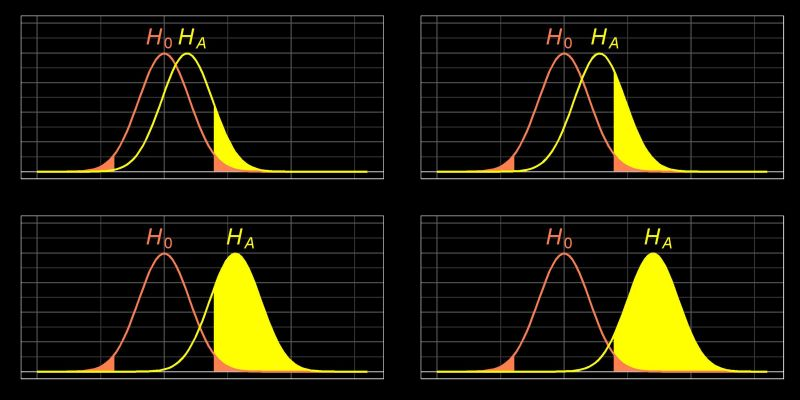

```{r setup, include=FALSE}
knitr::opts_chunk$set(echo = TRUE)
library(pwr)
library(tidyverse)
library(ggplot2)
```

# Power analysis in Statistics (reminder)

There is a probability of committing an error in making a decision about a hypothesis.

Hence two types of errors can occur in hypothesis, Type I error and Type II Error.

The probability of Type I error is denoted as α and the probability of Type II error is β.

Type 1 Error:- p(reject H0/H0 is true)=α

Type II Error:- p(accept H0/HA is true)=β


```{r, out.width = "350px", fig.align="center" , echo=FALSE}



```


[A note about alpha and beta]{.underline}

**alpha** is described as the type I error, or the probability of declaring significant a difference that is not truly significant. We often use a two-sided alpha, which cuts the region of significance in half, and distributes it to both tails of the distribution, allowing for both significant positive and negative differences. Alpha is commonly set at 0.05, which works out to 0.025 on each tail of the distribution with a two-tailed alpha.

**beta** is the power, or (1- the risk of type II error). Type II error is the probability of missing a significant result and declaring it nonsignificant after hypothesis testing. Power is often set at 80%, or 0.8, but can be 90%, 95%, or 99%, depending on how important it is not to miss a significant result, and how much money and time you have to spend (both of which tend to increase N and power).

There is often an important tradeoff between type I and type II error. Things that decrease type II error (increase power) like spending more time and money for a larger N, will increase your risk of type I error. Conversely, reducing your risk of type I error will generally increase your risk of type II error. You may be in situations in which you have to decide which type of error is more important to avoid for your situation to maximize benefit and minimize harms for participants/patients.

[Power of the test]{.underline}

For testing a hypothesis H0 against HA, the test with probabilities α and β of Type I and Type II errors respectively, the quantity (1- β) is called the power of the test.

The power of the test depends upon the difference between the parameter value specified by H0 and the actual value of the parameter.

**The level of significance may be defined as the probability of Type I error which is ready to tolerate in making a decision about H0.E**

[The following parameters required to do a power analysis]{.underline}

-   Sample size
-   Effect size
-   Significance level
-   Power of the test

If we have any of the three parameters given above, we can calculate the fourth one.

Then you just need to define your test type (the options are "two.sample", "one.sample", and "paired"), and the alternative ("two.sided", "greater", or "less").

# Calculations in R with `{pwr}`

When designing studies, it is often important to calculate a reasonable estimate of the needed sample size.

Grant funding agencies will be **really** interested in whether you have a good rationale for your proposed sample size and timeline.

Fortunately, the {pwr} package is here to help.

The {pwr} package has a number of functions for calculating sample size and power.

| Test                                               | Sample Size Function |
|-------------------------------------------------|-----------------------|
| one-sample, two-sample, and paired t-tests         | pwr.t.test()         |
| two-sample t-tests (unequal sample sizes)          | pwr.t2n.test()       |
| two-sample proportion test (unequal sample sizes)  | pwr.2p2n.test()      |
| one-sample proportion test                         | pwr.p.test()         |
| two-sample proportion test                         | pwr.2p.test()        |
| two-sample proportion test (unequal sample sizes)  | pwr.2p2n.test()      |
| one-way balanced ANOVA                             | pwr.anova.test()     |
| correlation test                                   | pwr.r.test()         |
| chi-squared test (goodness of fit and association) | pwr.chisq.test()     |
| test for the general linear model                  | pwr.f2.test()        |

: Functions in the {pwr} package

## Sample Size for a Continuous Outcome (t-test)

Let's propose a study of a new treatment to reduce stress over a 3 days study period. You estimate that your recruited participants will have a mean baseline of 4.5 on a 10 points scale (**you have found this number form another study in your lab or from a paper**), which will be unchanged by your control treatment, but reduced (on average) to 3.5 by the study (**this might be harder to find, we will talk about ways to find approximations but for now just lets say we have this number**).

You need to calculate an effect size (aka **Cohen's d**) in order to estimate your sample size. This effect size is equal to the difference between the means, divided by the pooled standard deviation:

Cohen's d = (M2 - M1) ⁄ pooled standard deviation: where:

pooled standard deviation: = √((SD2 + SD1) ⁄ 2)

Many people can estimate the means and the difference, but the pooled standard deviation is not very intuitive. Sometimes you have an estimate from pilot data (**though these tend to have wide confidence intervals, as pilot studies are small**).

<!-- In other circumstances, you can estimate a standard deviation from values from a large dataset. When you don't have either of these, it can be helpful to start by estimating the range of values. -->

<!-- This is something that ***is*** intuitive, and experts can do fairly easily (**AKA ask your PIs**). Try ask them for the highest and lowest values of HgbA1c that they have ever seen. You will quickly find a minimum and maximum that you can estimate as the range (in this case, let's say 5.0 and 17.0 for min and max of Hgb A1c). This range divided by 4 is a reasonable rough estimate of the standard deviation. Remember that a normally distributed continuous value will have a 95% confidence interval that is plus or minus 1.96 standard deviations from the sample mean. Round this up to 2 for the full range, and you can see why we divide the range by 4 to get an estimate of the standard deviation. -->

In our case we will say that we found an effect size (Cohen's d) of 0.66 on a previous and similar study.

<!-- the difference is 2 and the range/4 (estimate of SD) is 3. So -->

```{r, error=TRUE, eval = TRUE}
pwr::pwr.t.test(n = NULL,
                sig.level = 0.05, 
                type = "two.sample", 
                alternative = "two.sided", 
                power = 0.80, 
                d = 0.66)
```

We come up with 37.02 participants in each group to provide 80% power to detect a difference between our two groups, assuming an effect size (Cohen's d) of 0.66, using a two-sided alpha of 0.05. To conduct this study, assuming a 20% dropout rate in each arm, would require 37+8 subjects per arm, or 90 overall. At an enrollment rate of 10 per day, it will require 9 day to enroll all the participants, and 12 days (9 + 3 days intervention) to complete the data collection.

**NB: It is a very common mistake to look at the result for n, and assume that this is your total sample size needed. The n provided by {pwr} is the number per arm.**

<!-- You need to multiply this n by the number of arms (or in a paired analysis, by the number of pairs) to get your total n.<br> <br> Another common mistake is to assume no dropout of participants. It is important to have a reasonable estimate (10-20% for short studies, 30-50% for long or demanding studies) and inflate your intended sample size by this amount. It is even better if you know from similar studies what the actual dropout rate was, and use this as an estimate (if there are similar previous studies). As a general rule, it is better to be conservative, and estimate a larger sample size, than to end up with p = 0.07. -->

### The other way around

What would our power be to detect a difference with 25 participants? You can set the power to NULL, and the n to 25 (remember that n is per arm).

```{r, error=TRUE, eval = TRUE}
pwr::pwr.t.test(n = 25, # note that n is per arm
                sig.level = 0.05, 
                type = "two.sample", 
                alternative = "two.sided", 
                power = NULL, 
                d = 0.66)
```

We end up with 62.8% power, assuming no participant dropout (which is an *extremely* unlikely assumption). You can do the same thing, changing the NULL, to calculate an effect size or a significance level, if you have any need to.

In most cases, you are calculating a sample size, then realizing that you might not have that much money/resources. Then many calculate the power you would obtain given the resources you actually have. Let's show a few more examples.


## One Sample t-test

<!-- TBD -->

Eddie Enema, holistic healer, has proposed an unblinded pilot study of thrice-daily 2 liter juices with "Eddie's Dialysis Cleanser," a proprietary mix of vitamins and minerals, which he believes will lower the serum creatinine of patients on the kidney transplant waiting list by more than 1.0 g/dL in 24 hours. The creatinine SD in this group of patients is 2.

The null hypothesis is \< 1.0 g/dL. The alternative hypothesis is \>= 1.0 g/dL.

Cohen's d is 1.0 (the proposed change, or delta)/2 (the SD) = 0.5.

How many participants would Eddie Enema have to recruit to have 80% power to test this one-sample, one-sided hypothesis, with an alpha of 0.05?

Check each of the argument values and run the chunk below to find out.

```{r, error=TRUE, eval = FALSE}
pwr::pwr.t.test(n = NULL, # note that n is per arm
                sig.level = 0.05, 
                type = "one.sample", 
                alternative = "greater", 
                power = 0.8, 
                d = 0.5)
```

Fast Eddie would need to recruit slightly more than 26 participants (you always have to round up to get whole human participants) to have 80% power, assuming no dropout between the first and third enema, or before the blood draw 24 hours after baseline. Note that since this is an unblinded, one-sample study, The n in the results is multiplied by the number of arms (there is only 1 arm) to give you a sample size of 27.


## Paired t-tests 

<!-- As you can see from the above example, you can use a before-after design to measure differences from baseline, and essentially convert a two-sample paired design (each participant's baseline measurement is paired with their post-intervention measurement) to a single sample design based on the difference between the before and after values. -->

The before-after (or baseline-postintervention) design is probably the most common paired design, but occasionally we have truly paired designs, like when we test an ointment for psoriasis on one arm, and use a placebo or sham ointment on the other arm. When this is possible, through bilateral symmetry (this also works for eyedrops in eyes, or dental treatments), it is much more efficient (in the recruiting sense) than recruiting separate groups for the treatment and control arms.

To see the difference between two-sample and paired designs, run the code chunk below, for a two-sample study with a Cohen's d of 0.8 and 80% power. Then change the type to "paired", and see the effect on sample size.

```{r, error=TRUE, eval = FALSE}
pwr::pwr.t.test(n = NULL, # note that n is per arm
                sig.level = 0.05, 
                type = "two.sample", 
                alternative = "two.sided", 
                power = 0.8, 
                d = 0.8)
```

Note that this changes the needed sample size from 52 subjects (26 per arm) to 15 subjects (as there is only one participant needed each paired application of 2 study treatments, and n in this case indicates the number of *pairs*), though it would be wise to randomize patients to having the treatment on the right vs. left arm (to maintain the blind). This is a ***large*** gain in recruiting efficiency. Use paired designs whenever you can.

## 2 Sample t tests with Unequal Study Arm Sizes

Occasionally investigators want unbalanced arms, as they feel that patients are more likely to participate if they have a greater chance of receiving the study drug than the placebo. It is fairly common to use 2:1 or 3:1 ratios. Larger ratios, like 4:1 or 5:1, are thought to risk increasing the placebo response rate, as participants assume that they are on the active drug. This is somewhat less efficient in recruiting terms, but it may improve the recruiting rate enough to compensate for the loss in efficiency.

This requires a slightly different function, the *pwr.t2n.test()* function. Let's look at an example below. Instead of n, we have n1 and n2, and we have to specify one of these, and leave the other as NULL. Or we can try a variety of ratios of n1 and n2, leaving the power set to NULL, and test numbers to produce the desired power.

We are proposing a study in which the expected reduction in systolic blood pressure is 10 mm Hg, with a standard deviation of 20 mm Hg. We choose an n1 of 40, and a power of 80%, then let the function determine n2.

```{r, error=TRUE, eval = FALSE}
pwr::pwr.t2n.test(n1 = 40,
                  n2 = NULL,
                sig.level = 0.05,
                alternative = "two.sided", 
                power = 0.8, 
                d = 0.5)
```

In this case, n2 works out to slightly over 153 in the drug arm, or nearly 4:1.


We can also round up the ratio to 4:1 (160:40) and determine the resulting power.

```{r, error=TRUE, eval = FALSE}
pwr::pwr.t2n.test(n1 = c(40),
                  n2 = c(160),
                sig.level = 0.05,
                alternative = "two.sided", 
                power = NULL, 
                d = 0.5)
```

This provides a power of 80.3%.  
<!-- question here -->

## Testing Multiple Options and Plotting Results


Sometimes it is helpful to look at multiple scenarios and plot the results. You can do this by leaving n = NULL, and plotting the results, as seen below. The null value will be varied across a reasonable range, and the results plotted, with an optimal value identified. The plot function will use ggplot2 if this package is loaded, or base R plotting if ggplot2 is not available. As you can see below, you can modify the ggplot2 plot of the results with standard ggplot2 functions.

```{r}
results <- pwr::pwr.t2n.test(n1 = c(40),
                  n2 = NULL,
                sig.level = 0.05,
                alternative = "two.sided", 
                power = 0.80, 
                d = 0.5)

plot(results) +
  ggplot2::theme_minimal(base_size = 14) +
  labs(title = 'Optimizing Sample Size for my 2-Sided t test',
       subtitle = "N ~ 194")
```

<!-- Note that the results object is a list, and you can access individual pieces with the dollar sign operator, so that `` `r "\u0060results$n1\u0060"` `` equals 40, and `` `r "\u0060results$n2\u0060"` `` equals 153. -->

<!-- You can examine the components of the results object in the Environment pane in RStudio. You can use these in inline R expressions in an Rmarkdown document to write up your results. Remember that each inline R expression is wrapped in backwards apostrophes, like `` `r "\u0060r code\u0060"` `` (using the character to the left of the 1 key on the standard US keyboard), and starts with an **r** to let the computer know that the incoming code is written in R. This helps you write up a sentence like the below for a grant application: -->

<!-- Using an estimated effect size of `r results$d`, with a two-sided alpha of `r results$sig.level`, we calculated that for `r results$n1` participants in group 1, `r results$n2` participants would be needed in group 2 to produce a power of `r results$power`. -->

<!-- When you knit an Rmarkdown file with these inline R expressions, each will be automatically converted to the result number and appear as standard text. -->

## Sample Sizes for Proportions

Let's assume that patients discharged from your hospital after a myocardial infarction have historically received a prescription for aspirin 80% of the time. A nursing quality improvement project on the cardiac floor has tried to increase this rate to 95%. How many patients do you need to track after the QI intervention to determine if the proportion has truly increased?

-   the null hypothesis is that the proportion is 0.8

-   the alternative hypothesis is that the proportion is 0.95.

For this, we need the *pwr.p.test()* function for **one proportion**.

We will also use a built-in function of {pwr}, the *ES.h()* function, to help us calculate the effect size. This function takes our two hypothesized proportions and calculates an effect size with an arcsine transformation.

```{r}
pwr.p.test(h = ES.h(p1 = 0.95, p2 = 0.80),
           n = NULL,
           sig.level = 0.05,
           power = 0.80,
           alternative = "greater")

```

We need to evaluate at least the next 28 patients discharged with MIs to have 80% power to test this one-sided hypothesis.


[A note about test sided-ness and publication.]{.underline}

Frequently in common use, you may only be focused on an increase or decrease in a proportion or a continuous outcome, and a one-sided test seems reasonable. This is fine for internal use or local quality improvement work.

However, for FDA approval of a drug, for grant applications, or for journal publications, the standard is to **always** use two-sided tests, being open to the possibility of both improvement or worsening of the outcome you are studying. This is important to know before you submit a grant application, a manuscript for publication, or a dossier for FDA approval of a drug or device.


## Sample size for two proportions, equal n

For this, we need the *pwr.2p.test()* function for **two proportions**.

You want to calculate the sample size for a study of a cardiac plexus parasympathetic nerve stimulator for pulmonary hypertension. You expect the baseline one year mortality to be 15% in high-risk patients, and expect to reduce this to 5% with this intervention. You will compare a sham (turned off) stimulator to an active stimulator in a 2 arm study. Use a 2-sided alpha of 0.05 and a power of 80%. Copy and edit the code chunk below to determine the sample size (n, rounded up) per arm, and the overall sample size (2n) fo the study.

```{r, error=TRUE, eval = FALSE}
pwr.p.test(h = ES.h(p1 = __, p2 = __),
           n = __,
           sig.level = __,
           power = __,
           alternative = "__")

```

We need to enroll at least 67 per arm, or 134 overall.

Dichotomous endpoints are generally regarded as having greater clinical significance than continuous endpoints, but often require more power and sample size (and more money and time). Most investigators are short on money and time, and prefer continuous outcome endpoints.

## Sample size for two proportions, unequal arms

For this, we need the *pwr.2p2n.test()* function for **two proportions with unequal sample sizes**.

Imagine you want to enroll class IV CHF patients in a device trial in which they will be randomized 3:1 to a device (vs sham) that restores their serum sodium to 140 mmol/L and their albumin to 40 mg/dL each night. You expect to reduce 1 year mortality from 80% to 65% with this device. You want to know what your power will be if you enroll 300 in the device arm and 100 in the sham arm.

```{r, error=TRUE, eval = FALSE}
pwr.2p2n.test(h = ES.h(p1 = __, p2 = __),
           n1 = __,
           n2 = __, 
           sig.level = __,
           power = __,
           alternative = "two.sided")
```

This (300:100) enrollment will have 84.6% power to detect a change from 15% to 5% mortality, with a two-sided alpha of 0.05.


## Conventional effect sizes
Here are all conventional effect sizes for all tests in the {pwr} package:

| test                      | small | medium | large |
|---------------------------|-------|--------|-------|
| tests for proportions (p) | 0.2   | 0.5    | 0.8   |
| tests for means (t)       | 0.2   | 0.5    | 0.8   |
| chi-square tests (chisq)  | 0.1   | 0.3    | 0.5   |
| correlation test (r)      | 0.1   | 0.3    | 0.5   |
| anova (anov)              | 0.1   | 0.25   | 0.4   |
| general linear model (f2) | 0.02  | 0.15   | 0.35  |

: These are only conventions and **should not be used blindly** because they differ in every disciplines and applications.
